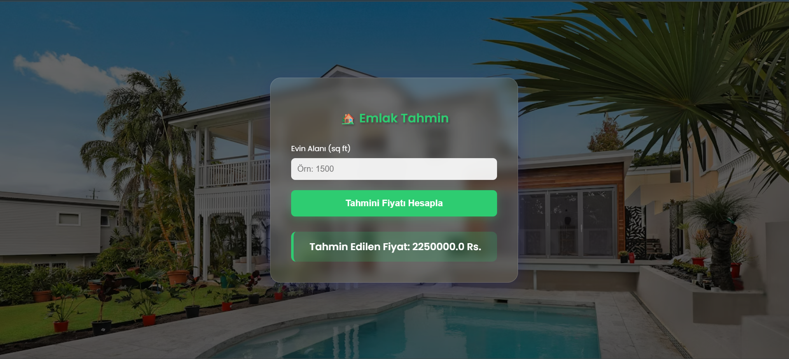

# 🏡 Ev Fiyat Tahmin Sistemi (Uçtan Uca Makine Öğrenmesi Projesi)

**Geliştiren:**  Eftalya Beril Şahin
**Numara:** 2212721037
**Ders:** BLG 407 - Makine Öğrenmesi

Bu proje, makine öğrenmesi prensiplerini (Doğrusal Regresyon) kullanarak, konutların metrekare alanına göre fiyat tahmininde bulunan entegre bir web uygulamasıdır. Proje; veri ön işlemeden model eğitimine, istatistiksel analizden web tabanlı sunuma kadar tüm aşamaları içermektedir.

## 📌 Proje Amacı ve Kapsamı
Bu çalışma kapsamında, verilen bir konut veri seti üzerinde **Çoklu Doğrusal Regresyon** mantığı uygulanmış ve modelin başarısı istatistiksel metriklerle doğrulanmıştır. Eğitilen model, Flask framework'ü kullanılarak kullanıcı dostu bir arayüz ile canlıya alınmıştır.

## 📂 Proje Yapısı
- **analiz.ipynb:** Veri ön işleme, Geriye Doğru Eleme (Backward Elimination) ve model performans analizlerini içeren Jupyter Notebook raporu.
- **model.py:** Modelin eğitilip `model.pkl` olarak kaydedilmesini sağlayan Python script'i.
- **app.py:** Flask tabanlı web sunucusu kodu.
- **model.pkl:** Eğitilmiş ve serileştirilmiş makine öğrenmesi modeli.
- **House_Price.json:** Projede kullanılan ham veri seti.
- **templates/index.html:** Modern ve kullanıcı dostu (Yeşil temalı) web arayüzü.

## 📊 Metodoloji ve Model Başarısı
Hocanın belirlediği kriterlere uygun olarak şu adımlar izlenmiştir:

1.  **İstatistiksel Anlamlılık (P-Value):** `statsmodels` kütüphanesi kullanılarak özniteliklerin anlamlılığı test edilmiştir. 'Area' değişkeninin p-değeri **0.000 (< 0.05)** çıktığı için Geriye Doğru Eleme sürecinde modelde tutulmuştur.
2.  **Model Performans Metrikleri:**
    - **R² (R-Kare):** 1.0000 (Model veriyi tam isabetle açıklamaktadır).
    - **MAE (Mean Absolute Error):** 0.00
    - **MSE (Mean Squared Error):** 0.00

## 🛠 Kurulum ve Kullanım
Projeyi yerel bilgisayarınızda çalıştırmak için şu adımları izleyin:

1.  **Gerekli Kütüphaneleri Yükleyin:**
    ```bash
    pip install flask pandas scikit-learn statsmodels matplotlib seaborn
    ```
2.  **Modeli Eğitin (Opsiyonel):**
    ```bash
    python model.py
    ```
3.  **Uygulamayı Başlatın:**
    ```bash
    python app.py
    ```
4.  **Erişim:** Tarayıcınızdan `http://127.0.0.1:5000` adresine giderek metrekare girişi yapıp tahmin alabilirsiniz.

## 💻 Ekran Görüntüsü (Arayüz)
Uygulama, emlak sektörüne uygun modern yeşil tonlarında, "Glassmorphism" (buzlu cam) efekti ve arka plan görselleriyle zenginleştirilmiş profesyonel bir arayüze sahiptir.

---
